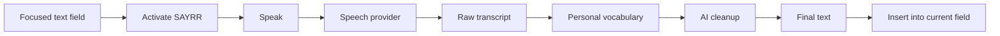

<div align="center">

# 🎙️ SAYRR

### Speak anywhere you type.

<p>


</p>

**Turn natural speech into clean text and place it directly where you are typing.**

</div>

---

## ⚡ The idea

SAYRR is a voice-first input layer. The product is not a dashboard with a microphone attached. The core experience is **focus → speak → transcribe → clean → insert**.

<table>
<tr><td width="50%">

### 📱 Mobile
Selectable system keyboard/input method for Android and iOS/iPadOS.

- Android Input Method Editor (IME)
- iOS/iPadOS custom keyboard extension
- Punctuation and cleanup
- Personal vocabulary

</td><td width="50%">

### 🖥️ Desktop
A lightweight resident application with native insertion capabilities.

- Global activation shortcut
- Voice launcher
- Streaming transcription
- Artificial Intelligence (AI) cleanup
- Clipboard/keyboard fallback

</td></tr>
</table>

## 🔄 Core experience



<details open>
<summary><strong>🏗️ Architecture</strong></summary>

```text
apps/desktop/       Tauri desktop application
packages/contracts/ shared contracts
packages/voice-core voice session and provider abstractions
native/             platform-native bridges
supabase/           accounts, vocabulary, preferences, history, usage metadata
docs/               product, architecture, privacy, testing, roadmap
```

</details>

## 🧠 Product principles

1. Voice insertion is the core product, not the dashboard.
2. Use platform-native input mechanisms where possible.
3. Do not store raw audio by default.
4. Personal vocabulary is first-class data.
5. Cleanup should preserve meaning rather than rewrite aggressively.
6. Every platform needs an explicit fallback.
7. Permissions and privacy are architectural concerns.
8. V1 proves the input experience before autonomous actions are added.

## 🛠️ Technology direction

| Layer | Technology |
| --- | --- |
| Shared application logic | TypeScript |
| Desktop shell | Tauri 2.x |
| Native desktop integration | Rust |
| Android | Kotlin / Java |
| iOS/iPadOS | Swift |
| Data | Supabase PostgreSQL |
| Supporting web/API services | Vercel where appropriate |
| Speech | Provider abstraction |

## 📚 Documentation

The repository is organized around the product and architecture specification set in `docs/`, including privacy/security, platform architecture, data model, API contracts, test matrix, beta plan, and release checklist.

<details>
<summary><strong>📁 Documentation map</strong></summary>

```text
docs/
├── PRODUCT_SPECIFICATION.md
├── ARCHITECTURE.md
├── PLATFORM_ARCHITECTURE.md
├── DATA_MODEL.md
├── API_CONTRACT.md
├── PRIVACY_SECURITY.md
├── ROADMAP.md
├── TEST_MATRIX.md
├── PROVIDER_EVALUATION.md
├── BETA_PLAN.md
├── RELEASE_CHECKLIST.md
└── adr/
```

</details>

## 📍 Status

**Phase 1: Desktop foundation in progress.**

## 🔐 Ownership

SAYRR is proprietary product software. See [`LICENSE`](./LICENSE) for usage restrictions.
